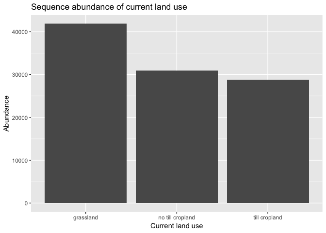
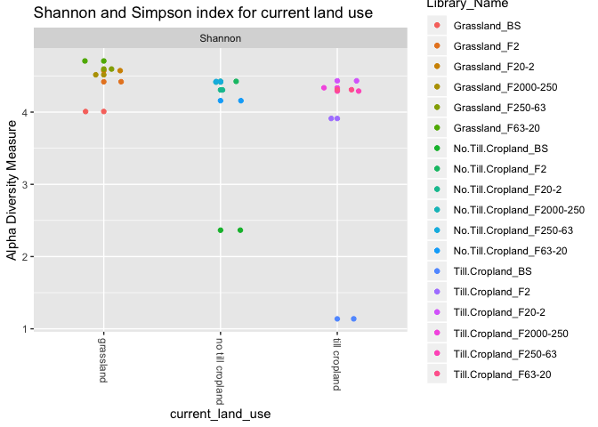
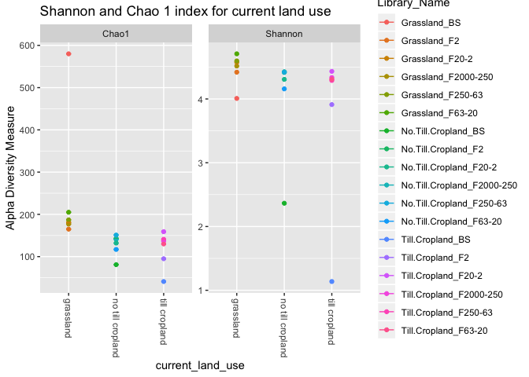
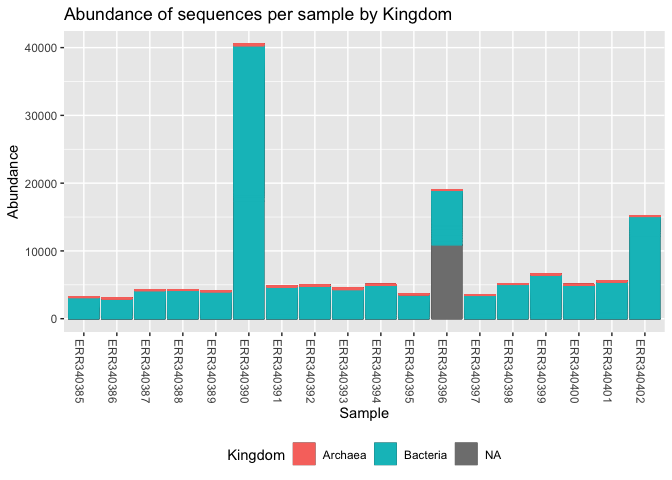
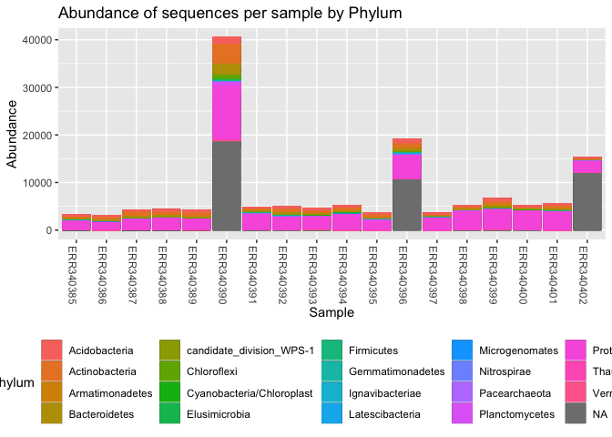
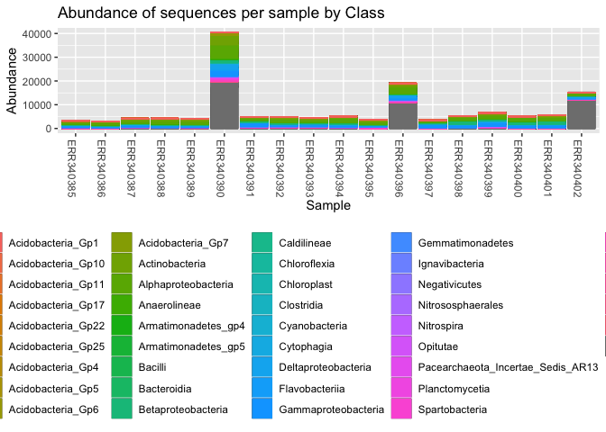
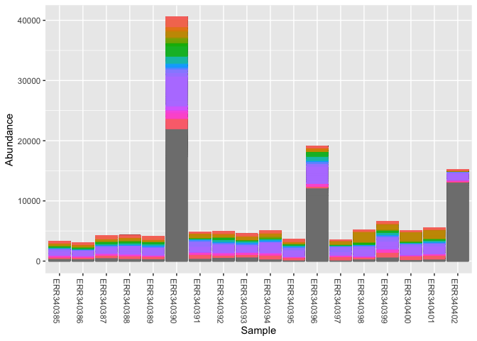
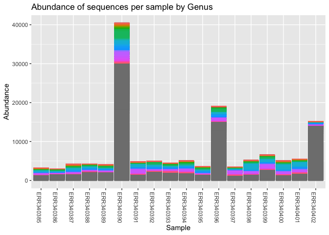
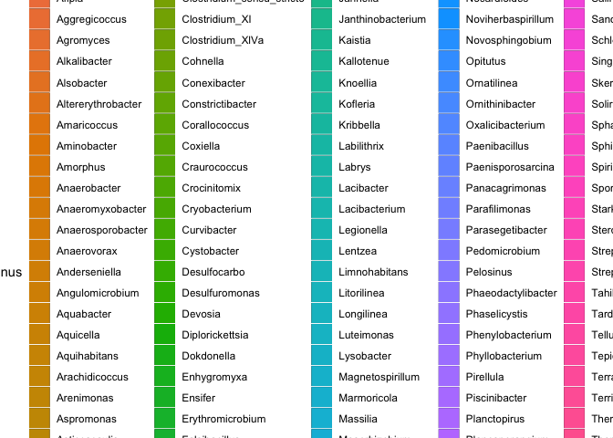

Final Report: Your Title Here
================
Derek Newberger
November, 26 2018

Introduction
============

Add about 2-3 pages here. Across the whole manuscript, you should cite at least 20 peer reviewed articles.

Relevant abiotic factors in this study include characteristics of soil and chemistry of the organic compound within it. The study placed sample weights into three main categories, macroaggregates (250-2,000 μm and 63-250 μm), microaggregates (20-63μm and 2-20 μm), and clay particles (2 μm). In its broadest sense, a macroaggregates are simply relatively large particles. Similar studies have described macroaggregates as 250-2,000 μm clumps which form from fresh residues since it is a carbon source for microbes and encourages the production of micro-derived binding agents. Microaggregates are formed within the much larger macroaggregates and typically maintains stability even if the macroaggregate it is inside, breaks apart. Bothof these structures influence the C-N availability (Six *et al.*, 2000). The study defined clay particles as particles, lower than 2 μm, which is in line with most estimates and although not explicitly defined, the silty-clay particles can be defined as soil particles that are intermixed with paticles between 2-50 μm (<span class="citeproc-not-found" data-reference-id="six2000soil:1">**???**</span>).

Methods
=======

Study design of Constancias et al. 2014
---------------------------------------

### Field soil sampling:

During springtime in Burgundy, France in the agricultural landscape of Fénay, soils were sampled from three plots of soil characterized by silty clay calcisol. The agricultural practices on the grassland plot, the tilled plot, and the stubble ploughed plot, of the past eight years were monitored. Each plot had minor differences in their parameters. For sampling, a geological reference point of one meter was used and soil cores were from the surface horizon (0-20 cm) and pooled. After being sieved (2mm), the samples were air dried, and then stored at 4 C until the fraction procedure.

### Soil fractionation procedure:

They used a gentle physical soil fraction method (Chotte et al. 2002), to isolate the soil microenvironments by size. A subsample of 50 g of 2-mm was shaken in 250 mL of Milli-Q water for 3 h. Using the two sieves (250- and 63-μm) particles and water-stable aggregates were separated by wet sieving in approximately 3 cm of water 60 times during 2 min. The 2,000–250- and 250–63-μm fractions were macroaggregates associated to coarse and fine sands, respectively. Stoke’s law was used to separate the microaggregates with particles of silt and loam by sedimentation and siphoning. Water was removed as clay fractions of &lt;2 μm were recovered by centrifuging at 11,000g, 4 °C for 20 min. Samples were then freeze-dried. This procedure was carried out in replicates. Replicates were lyophilized and stored at −40 °C, and the three subsamples were used for physicochemical and microbiological analysis.

### Soil physicochemical analysis

The lyophilized fractions were weighed, organic carbon and total nitrogen contents of samples were characterized according to NF ISO 10694 and 13878. Soil texture of bulk soils was determined according to NF X 31–107. Size distribution of the particles and aggregates of each fraction was verified by laser granulometry (Mastersizer 2000, Malvern Ltd). Using adhesive graphite tabs, aluminum stubs gold-palladium (12–15 nm thick), Polaron SC 7620 Mini Sputter Coater, samples were observed with a Philips XL-30ESEM LaB6 scanning electron microscope at 14 kV.

Sample origin and sequencing of Constancias et al. 2014
-------------------------------------------------------

### Soil DNA extraction, pyrosequencing, and data analysis

Using the GnsGII procedure (Plassart et al. 2012), soil microbial DNA was extracted and purified from soil samples. Bacterial density was estimated by real-time quantitative PCR of 16S rRNA gene which were then amplified with 341F and 515R primers on 1 ng of template DNA and using the Veriti® Thermal Cycler. Using 454-pyrosequencing of the 16S rRNAV3–V4 gene region (Terrat et al. 2012). The first PCR used primers F479 and R888, while the second used purified PCR products from the first one. Ten base-pair multiplex identifiers (MID) were added to the primers at 5′ position. Pyrosequencing was then carried out on a GS Junior And the data were processed using the GnS-PIPE of the GenoSol platform (Terrat et al. 2012). Raw sequences were discarded if they had ambiguous base calls, length less than 350 nt, or if they contained any ambiguity (Ns). Using infernal alignments that use secondary structure of 16S rRNA gene Sequences, sequences that clustered at 95 % sequence similarity into operational taxonomic units (OTU) were identified. A filter for potential sources (chimeras, sequencing errors, OTU overestimation) of errors was applied. To compare the datasets, quality sample reads were reduced by random selection to the lowest dataset, i.e., 2,060 randomly quality-selected sequences per sample. High-quality reads were used for taxonomy-based analysis using USEARCH against reference databases from the Silva (Quast et al. 2013), with sequences longer than 500 nucleotides. Using UniFrac we compared the sampled bacterial communities (Lozupone and Knight 2005). UniFrac community analyses were based on a phylogenetic tree computed with FastTree using the most abundant read to represent each OTU. A weighted UniFrac distance measure was then realized to compute a dendrogram by using the PycoGent package (Knight et al. 2007). I found the raw data sets On NCBI with EBI database system tags using project accession number PRJEB4553.Differences between physicochemical characteristics, density, and diversity in bacterial communities were tested by ANOVA, multiple paired comparisons with P &lt;0.05. Using the heatmap.2 function the heatmap figure was built and the gplots R package was used for the relative abundance values of the most dominant bacterial genus across the samples. The mean of each taxonomic group across sample types was calculated and colored by a corresponding Z score.

Computational
-------------

These are the methods you used to do your bioinformatic analyses analyses. Should probably be between 0.5 and 1 pages. At a very minimum should include citations for DADA2 and phyloseq if you are doing an amplicon study, or other citations as appropriate.

Results
=======

Subsections are ok in the results section too
---------------------------------------------

``` r
# Add code chunks as needed for your analyses
# For most analyses, I would recommend splitting the
# intensive computational part into a seperate R script file
# and then just load your libraries and the data object here
# using the `load()` function. Ask me for clarification if this is
# unclear.
```

``` r
# load general-use and special packages
library("dplyr")
library("tidyr")
library("knitr")
library("ggplot2")
library("citr")
library("dada2")
library("seqinr")
library("mctoolsr")
library("phyloseq")
load("output/phyloseq_obj.Rdata")
# load data produced from analysis scripts using
# something like load("output/processed_data.Rdata")
```

``` r
phyloseq_obj_abundancies <- subset_samples(phyloseq_obj, # a new phyloseq object
                                  current_land_use == "grassland" |
                                    current_land_use == "till cropland" |
                                    current_land_use == "no till cropland")
plot_bar(phyloseq_obj_abundancies, x = "current_land_use",
          title = "Sequence abundance of current land use") +
  xlab("Current land use")
```


``` r
phyloseq_abundances_f <- subset_samples(phyloseq_obj, # new object
                                    current_land_use == "grassland" |
                                    current_land_use == "till cropland" |
                                    current_land_use == "no till cropland")
phyloseq_table <- psmelt(phyloseq_abundances_f) %>%
filter(Abundance < 600)
ggplot(phyloseq_table, aes(x = current_land_use, y = Abundance)) +
  geom_col() + ggtitle("Sequence abundance of current land use") +
xlab("Current land use")
```



``` r
plot_richness(phyloseq_obj,
               x = "current_land_use",
               measures = c("Shannon"),
              color = ("Library_Name"),
title = ("Shannon index for current land use"))
```

    ## Warning in estimate_richness(physeq, split = TRUE, measures = measures): The data you have provided does not have
    ## any singletons. This is highly suspicious. Results of richness
    ## estimates (for example) are probably unreliable, or wrong, if you have already
    ## trimmed low-abundance taxa from the data.
    ## 
    ## We recommended that you find the un-trimmed data and retry.



``` r
plot_richness(phyloseq_obj,
               x = "current_land_use",
               measures = c("Shannon", "Chao1"),
              color = "Library_Name",
              title = "Shannon and Simpson index for current land use")
```

    ## Warning in estimate_richness(physeq, split = TRUE, measures = measures): The data you have provided does not have
    ## any singletons. This is highly suspicious. Results of richness
    ## estimates (for example) are probably unreliable, or wrong, if you have already
    ## trimmed low-abundance taxa from the data.
    ## 
    ## We recommended that you find the un-trimmed data and retry.

    ## Warning: Removed 18 rows containing missing values (geom_errorbar).



``` r
plot_bar(phyloseq_obj, fill = "Kingdom") +
  geom_bar(aes(color = Kingdom,
               fill = Kingdom),
           stat = "identity",
           position = "stack") +
  ggtitle("Abundance of sequences per sample by Kingdom") +
  theme(legend.position = "bottom")
```



``` r
as.data.frame(tax_table(phyloseq_obj)) %>%
group_by(Kingdom) %>%
  tally() %>%
  arrange(desc(n)) %>%
  head(3) %>%
  kable(col.names = c("Kingdom",
                    "Frequency"))
```

| Kingdom  |  Frequency|
|:---------|----------:|
| Bacteria |       2921|
| Archaea  |         38|
| NA       |          3|

``` r
plot_bar(phyloseq_obj, fill = "Phylum") +
    geom_bar(aes(color = Phylum,
               fill = Phylum),
           stat = "identity",
           position = "stack") +
  ggtitle("Abundance of sequences per sample by Phylum") +
  theme(legend.position = "bottom")
```



``` r
as.data.frame(tax_table(phyloseq_obj)) %>%
group_by(Phylum) %>%
  tally() %>%
  arrange(desc(n)) %>%
  head(10) %>%
  kable(col.names = c("Phylum",
                    "Frequency"))
```

| Phylum                     |  Frequency|
|:---------------------------|----------:|
| Proteobacteria             |       1318|
| Actinobacteria             |        472|
| Bacteroidetes              |        254|
| NA                         |        194|
| Planctomycetes             |        163|
| Acidobacteria              |        127|
| Firmicutes                 |        120|
| Chloroflexi                |         87|
| Nitrospirae                |         52|
| candidate\_division\_WPS-1 |         45|

``` r
plot_bar(phyloseq_obj, fill = "Class") +
  geom_bar(aes(color = Class,
               fill = Class),
           stat = "identity",
           position = "stack") +
  ggtitle("Abundance of sequences per sample by Class") +
  theme(legend.position = "bottom")
```



``` r
as.data.frame(tax_table(phyloseq_obj)) %>%
group_by(Class) %>%
  tally() %>%
  arrange(desc(n)) %>%
  head(10) %>%
  kable(col.names = c("Class",
                    "Frequency"))
```

| Class               |  Frequency|
|:--------------------|----------:|
| Alphaproteobacteria |        543|
| Actinobacteria      |        456|
| NA                  |        381|
| Gammaproteobacteria |        330|
| Deltaproteobacteria |        208|
| Betaproteobacteria  |        180|
| Planctomycetia      |        159|
| Sphingobacteriia    |        114|
| Cytophagia          |         69|
| Acidobacteria\_Gp6  |         55|

``` r
plot_bar(phyloseq_obj, fill = "Order") +
  geom_bar(aes(color = Order,
               fill = Order),
           stat = "identity",
           position = "stack") +
  theme(legend.position = "none")
```



``` r
  ggtitle("Abundance of sequences per sample by Order")
```

    ## $title
    ## [1] "Abundance of sequences per sample by Order"
    ## 
    ## $subtitle
    ## NULL
    ## 
    ## attr(,"class")
    ## [1] "labels"

``` r
as.data.frame(tax_table(phyloseq_obj)) %>%
group_by(Order) %>%
  tally() %>%
  arrange(desc(n)) %>%
  head(10) %>%
  kable(col.names = c("Order",
                    "Frequency"))
```

| Order              |  Frequency|
|:-------------------|----------:|
| NA                 |        609|
| Rhizobiales        |        401|
| Actinomycetales    |        185|
| Xanthomonadales    |        181|
| Gaiellales         |        143|
| Planctomycetales   |        142|
| Burkholderiales    |        133|
| Myxococcales       |        126|
| Sphingobacteriales |        114|
| Pseudomonadales    |         85|

``` r
plot_bar(phyloseq_obj, fill = "Genus") +
  geom_bar(aes(color = Genus,
               fill = Genus),
           stat = "identity",
           position = "stack") +
   theme(legend.position = "none")
```



``` r
  ggtitle("Abundance of sequences per sample by Genus")
```

    ## $title
    ## [1] "Abundance of sequences per sample by Genus"
    ## 
    ## $subtitle
    ## NULL
    ## 
    ## attr(,"class")
    ## [1] "labels"

``` r
as.data.frame(tax_table(phyloseq_obj)) %>%
  group_by(Genus) %>%
  tally() %>%
  arrange(desc(n)) %>%
  head(31) %>%
  kable(col.names = c("Genus", "Frequency"))
```

| Genus                       |  Frequency|
|:----------------------------|----------:|
| NA                          |       1517|
| Gaiella                     |        143|
| Pseudomonas                 |         77|
| Povalibacter                |         71|
| Nitrospira                  |         52|
| Massilia                    |         47|
| Nitrobacter                 |         39|
| Zavarzinella                |         36|
| Nocardioides                |         27|
| Pirellula                   |         26|
| Flavobacterium              |         25|
| Mesorhizobium               |         25|
| Gemmata                     |         24|
| Microvirga                  |         24|
| Ferruginibacter             |         22|
| Mycobacterium               |         21|
| Ramlibacter                 |         20|
| Terrimonas                  |         20|
| Agromyces                   |         19|
| Arenimonas                  |         19|
| Kribbella                   |         19|
| Conexibacter                |         16|
| Lysobacter                  |         16|
| Methyloceanibacter          |         16|
| Pedomicrobium               |         16|
| Brevundimonas               |         14|
| Phyllobacterium             |         14|
| Rhizobium                   |         14|
| Aquicella                   |         13|
| Nitrolancea                 |         13|
| Clostridium\_sensu\_stricto |         12|

``` r
plot_bar(phyloseq_obj,
         x = "current_land_use",
         fill = "Genus") +
  geom_bar(aes(color = Genus,
               fill = Genus),
           stat = "identity",
           position = "stack") +
  theme(legend.position = "bottom")
```



In addition to a minimum of 5-8 figures/tables (and associated captions), you should include sufficient text in this section to describe what your findings were. Remember that in the results section you just describe what you found, but you don't interpret it - that happens in the discussion. 2-3 pages.

Discussion
==========

Add around 3-4 pages interpreting your results and considering future directions one might take in analyzing these data.

Sources Cited
=============

Six,J. *et al.* (2000) Soil macroaggregate turnover and microaggregate formation: A mechanism for c sequestration under no-tillage agriculture. *Soil Biology and Biochemistry*, **32**, 2099–2103.
