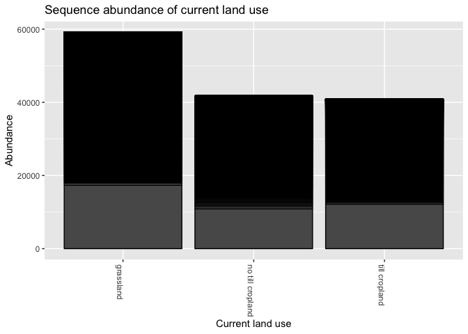
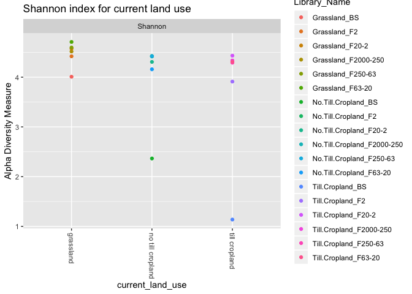
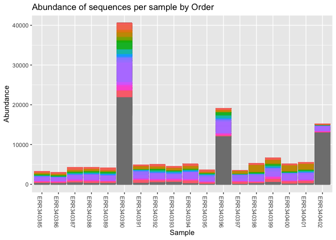
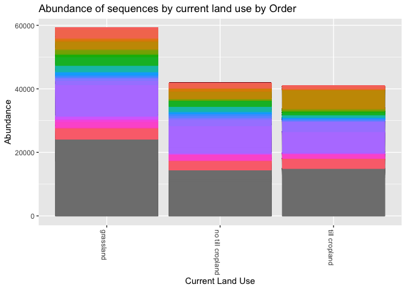
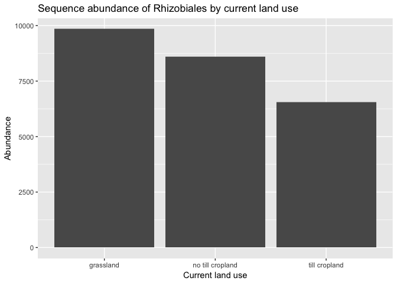
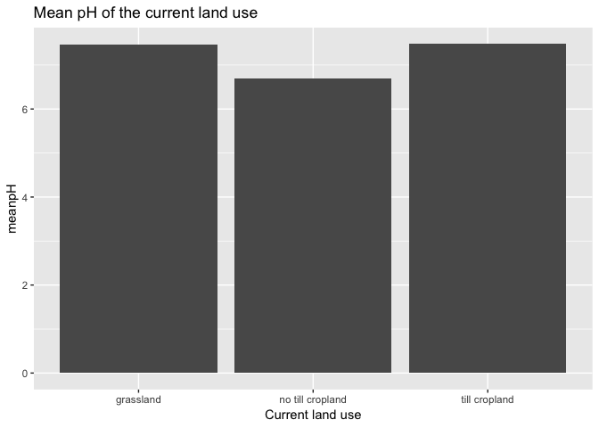

Final Report: Decrease of bacterial abundance and diversity by tilling
================
Derek Newberger
November 26th, 2018

Introduction
============

Since their initial discovery, microbes have been captivating audiences. The individual most known who bring microbes to focus was Anton van Leeuwenhoek, whose infectious enthusiasm of what lived between one’s teeth or under one’s finger nails captured the interest of those in even highest social ranks (Karamanou *et al.*, 2010). What a thrill it was to see this “invisible” world in constant motion, a world that lived right under and inside our noses. But once the curtain was lifted and the initial thrill died down, it became apparent that although these microbes had been living out of site, they had always been drastically affecting our lives. Diseased and infectious, contagious and vivacious, cultivated fear. Our world waged war upon theirs. We continue this practice, but we are continually gaining a better understanding of these microorganisms. We now consume probiotics (Goldin and Gorbach, 1992), and the consequences of antibiotics is becoming more apparent as we see that it is more important to maintain a healthy microbiome and how bacterial resistance can create even larger issues (Acar, 1997). There are numerous estimates of how many microorganisms reside in the human body. Estimates of how many microorganisms live in our body (in a 70 kg individual) range from 38 to 100 trillion, which is something spectacular since it is estimated that there is approximately 30 trillion human cells (Sender *et al.*, 2016). It is important to keep in mind the typical size difference between eukaryotic and prokaryotic cells (though not all microorganisms are prokaryotic). However, estimates of the abundance of microorganisms in soil is even greater. It is estimated that in one gram of soil can host 10 billion microorganisms and thousands of different species (Constancias *et al.*, 2014). Using the previous estimate in humans, per 70 kg of soil there is 700 trillion microorganisms, a much larger number no matter the given estimate. Some individuals dedicate more time than others to interact with their local soil, but we all eat. I would like for you to consider how our current agricultural practices influence the bacterial diversity in our crop land. The study of interest is on the effects of tilling on the bacterial density and diversity in cropland. Florentin Constancias and collaborators were interested in how soil microbes, which play a major role in forming organic matter in the soil that is utilized by crops as fertilizers, are affected by the current agricultural practice of tilling. Their goal was to describe how this high soil disturbance practice impacts bacterial abundance and diversity, but one a micro-environment scale of micrometers to millimeters, in a time when previous studies had focused on the macro-scale of meters to kilometers. They looked at density and diversity in crop soil under grassland, tillage plots, and no tillage (stubble plowed) plots (Constancias *et al.*, 2014). I wish to review the results of this article by attempting to replicate their results and thus support their conclusions. I will focus on their larger take home messages as receive a better understanding in what they mean by stating that the difficulties in characterizing indigenous microbial populations have reduced. I have no doubt that with next generation sequencing (NGS) that these issues have been reduced but am curious to see how many sequences that the Ribosomal database fails to identify. The authors used a curated database called Silva, and it will be interesting to see how the results from dada using the Ribosomal Database Project (RDP) compares in regard to taxa profiling. Additionally, I wish to utilize their data on pH level. In their introduction they mentioned the importance that pH has on microorganisms three different times in that soil characteristics like pH drive microbial abundance and diversity (unlike climate and geomorphologies (Dequiedt *et al.*, 2011; Fierer and Jackson, 2006), heterogeneous and nonrandom distribution of the abundance and diversity of soil microbial communities influence soil characteristics like pH (Constancias *et al.*, 2014; Zinger *et al.*, 2011), and soils provide a mosaic of micro-environments differing in pH (Mummey *et al.*, 2006; Ranjard and Richaume, 2001)). It breaks my heart to see that someone planned on recording pH, took the measurements in the field, performed data entry and a literature review of pH, and failed to have either the room, time, or findings to report anything within their article on it. I also want to dive a little bit deeper in the question of nitrogen fixation, by looking if and where these bacteria are located, if different crop intensities reveal a pattern, and if pH has a clear influence on these bacteria from the data of this study. We will also try to follow nitrogen. For this article, terms and concepts that are relevant to understanding the article itself and this analysis will be defined and organized by abiotic and biotic factors. Relevant abiotic factors in this study include characteristics of soil and chemistry of the organic compound within it. The study placed sample weights into three main categories, macroaggregates (250-2,000 μm and 63-250 μm), microaggregates (20-63μm and 2-20 μm), and clay particles (2 μm) (Constancias *et al.*, 2014). In its broadest sense, a macroaggregate is simply a relatively large particle. Similar studies have described macroaggregates as 250-2,000 μm clumps which form from fresh residues since it is a carbon source for microbes and encourages the production of micro-derived binding agents (Six *et al.*, 2000). Microaggregates are formed within the much larger macroaggregates and typically maintains stability even if the macroaggregate it is inside, breaks apart. Both of these structures influence the C-N availability The study defined clay particles as particles, lower than 2 μm, which is in line with most estimates and although not explicitly defined, the silty-clay particles can be defined as soil particles that are intermixed with particles between 2-50 μm (<span class="citeproc-not-found" data-reference-id="six2000soil:1">**???**</span>). Bulk is soil outside the rhizosphere and is not penetrated by plant roots. The rhizosphere contains more natural organic compounds and micro populations than bulk soil (Blake and Hartge, 1986). Calcisol, is a soil with a substantial secondary accumulation of lime. Calcisols are widespread in arid and semi-arid environments with a substantial secondary accumulation of lime (calcium oxide). Though not the most suitable for agriculture, calcisol environments can be irrigated, drained (prevents salinization) and fertilized, to become a highly productive (Ibáñez *et al.*, 2015; Meeus, 1995). Not being defined in the article, it is interesting to note that this probably means that a significant amount of fertilizer is used for these plots, bringing in a different batch of microbes. Additionally, an important micronutrient if calcium, which may encourage the growth of some bacteria over others (Thys-Jacobs, 2000).

The biotic factors in the study and my analysis consist which bacteria we observed to live in the soil and agricultural techniques applied by humans to instigate biological and chemical change of the soil. Proteobacteria is a phylum of Gram-negative bacteria that include pathogens and bacteria that induce nitrogen fixation in symbiosis with plants (Madigan *et al.*, 1997). A class with in Proteobacteria is Alphaproteobacteria, whose functions varies from phototrophy, metabolizing C1-compounds, and symbionts of plants (Garrity *et al.*, 2005). Rhizobiales are an order of Gram-negative under Alphaproteobacteria and are nitrogen fixation symbiotes composed of four families, Bradyrhizobiaceae, Hyphomicrobiaceae, Rhizobiaceae, and Phyllobacteriaceae (Brenner *et al.*, 2015). Actinobacteria is a phylum of Gram-positive bacteria, they help to decompose organic matter for plant uptake and are primarily soil bacteria who can also potentially fix nitrogen (Ghai *et al.*, 2011). Acidiobacteria is a phylum and Acidobacteria GP6 (a class) and subgroups’ presence correlate with low values of soil pH in the northern hemisphere (Catão *et al.*, 2014). Gaiella (occulta) has been isolated from deep mineral water in Portugal (Albuquerque *et al.*, 2011). Pseudomonas is a genus that can be a human pathogen, soil bacterium, or plant growth-promotor (Euzéby, 1997). Massilia is a genus in the rhizosphere that colonizes plant roots to promote growth development (Berg *et al.*, 2014). There are plenty more taxa that could be described, but those are the ones that will be focused on. Tillage is generally described as having the greatest impact on biological properties with a strong physical disturbance of soil, leading to a decrease of soil macroaggregate content (Oorts *et al.*, 2007). Temperate Grasslands can characterize about 20% of the land in Europe, which include France where the study took place. They can be nutrient-rich due to decay of deep branched grass roots and about 47% of grasslands have been converted into agricultural or urban developments (Soussana *et al.*, 2004), much like the crop plots in the study. They describe it as unpastured meadow plot frequently mowed since 2002 (Constancias *et al.*, 2014). The study used two cultivated plots under the same crop rotation of rapeseed, wheat, and barley (Constancias *et al.*, 2014). The plot labeled as “not tilled” was only stubble ploughed which means that the tilling was shallow and performed immediately before sowing to loosen the surface and damage insect cocoons that reside of the superficial layer of soil (Wheatley *et al.*, 1995). Lastly, plants require nitrogen because it is essential in chloroplast formation (Turner and Jund, 1994). In conclusion, we have discussed the study in question, the intent of the analysis, and the abiotic and biotic factors in depth to provide sufficient background for the analysis.

Methods
=======

**Study Design of Constancias et al. 2014**
-------------------------------------------

### Field Soil Sampling:

During springtime in Burgundy, France in the agricultural landscape of Fénay, soils were sampled from three plots of soil characterized by silty clay calcisol. The agricultural practices on the grassland plot, the tilled plot, and the stubble ploughed plot, of the past eight years were monitored. Each plot had minor differences in their parameters. For sampling, a geological reference point of one meter was used and soil cores were from the surface horizon (0-20 cm) and pooled. After being sieved (2mm), the samples were air dried, and then stored at 4 C until the fraction procedure.

### Soil Fractionation Procedure:

They used a gentle physical soil fraction method (Chotte et al. 2002), to isolate the soil microenvironments by size. A subsample of 50 g of 2-mm was shaken in 250 mL of Milli-Q water for 3 h. Using the two sieves (250- and 63-μm) particles and water-stable aggregates were separated by wet sieving in approximately 3 cm of water 60 times during 2 min. The 2,000–250- and 250–63-μm fractions were macroaggregates associated to coarse and fine sands, respectively. Stoke’s law was used to separate the microaggregates with particles of silt and loam by sedimentation and siphoning. Water was removed as clay fractions of &lt;2 μm were recovered by centrifuging at 11,000g, 4 °C for 20 min. Samples were then freeze-dried. This procedure was carried out in replicates. Replicates were lyophilized and stored at −40 °C, and the three subsamples were used for physicochemical and microbiological analysis.

### Soil Physicochemical Analysis

The lyophilized fractions were weighed, organic carbon and total nitrogen contents of samples were characterized according to NF ISO 10694 and 13878. Soil texture of bulk soils was determined according to NF X 31–107. Size distribution of the particles and aggregates of each fraction was verified by laser granulometry (Mastersizer 2000, Malvern Ltd). Using adhesive graphite tabs, aluminum stubs gold-palladium (12–15 nm thick), Polaron SC 7620 Mini Sputter Coater, samples were observed with a Philips XL-30ESEM LaB6 scanning electron microscope at 14 kV.

Sample Origin and Sequencing of Constancias et al. 2014
-------------------------------------------------------

### Soil DNA Extraction, Pyrosequencing, and Data Analysis

Using the GnsGII procedure, soil microbial DNA was extracted and purified from soil samples. Bacterial density was estimated by real-time quantitative PCR of 16S rRNA gene which were then amplified with 341F and 515R primers on 1 ng of template DNA and using the Veriti® Thermal Cycler. Using 454-pyrosequencing of the 16S rRNAV3–V4 gene region. The first PCR used primers F479 and R888, while the second used purified PCR products from the first one. Ten base-pair multiplex identifiers (MID) were added to the primers at 5′ position. Pyrosequencing was then carried out on a GS Junior And the data were processed using the GnS-PIPE of the GenoSol platform. Raw sequences were discarded if they had ambiguous base calls, length less than 350 nt, or if they contained any ambiguity (Ns). Using infernal alignments that use secondary structure of 16S rRNA gene Sequences, sequences that clustered at 95 % sequence similarity into operational taxonomic units (OTU) were identified. A filter for potential sources (chimeras, sequencing errors, OTU overestimation) of errors was applied. To compare the datasets, quality sample reads were reduced by random selection to the lowest dataset, i.e., 2,060 randomly quality-selected sequences per sample. High-quality reads were used for taxonomy-based analysis using USEARCH against reference databases from the Silva, with sequences longer than 500 nucleotides. Using UniFrac we compared the sampled bacterial communities. UniFrac community analyses were based on a phylogenetic tree computed with FastTree using the most abundant read to represent each OTU. A weighted UniFrac distance measure was then realized to compute a dendrogram by using the PycoGent package. I found the raw data sets On NCBI with EBI database system tags using project accession number PRJEB4553.Differences between physicochemical characteristics, density, and diversity in bacterial communities were tested by ANOVA, multiple paired comparisons with P &lt;0.05. Using the heatmap.2 function the heatmap figure was built and the gplots R package was used for the relative abundance values of the most dominant bacterial genus across the samples. The mean of each taxonomic group across sample types was calculated and colored by a corresponding Z score (constancias 2014).

**Computational of this Analysis with Acknowledgements**
--------------------------------------------------------

In order to retrieve this data, set I searched for an 16S amplicon dataset on NCBI. I looked for a dataset that was below one gigabyte of data and had metadata that had multiple different parameters that I could play with that was under the theme of soil microbiome in agricultural terms. I found an article by Constancias et al 2014 on the “Microscale evidence for a high decrease of soil bacteria density and diversity by cropping” which can be found at this link: <https://link.springer.com/article/10.1007/s13593-013-0204-3> where the PRJEB4553 can be found. It has 18 SRA experiments. I forked and cloned the repository to my github DerekNewberger-final-report from the class repository. A bash script was made to download the fastq files from NCBI. Then, a R script was made to utilize dada to filter and tether each sequence to a taxa as accurate and conservative as possible. I received help from Sanam, on which parameters to change and how the saving and loading functions worked. The sequences longer than 600 base pairs were filtered and trimmed since the quality appeared to suffer after 550 base pairs. I was recommended to keep some impure base pairs as to keep as many base pairs as possible and letting the error tools to do their job. We used build error models from each of the samples to learn of the possible error rates. Using derepfastq we removed any sequences that were duplicates which removed around half of the sequences we had remaining in the data set. Using dada and recommendations found on github for 454 data we adjusted the parameters and gave the HOMOPOLYMER\_GAP\_PENALTY a -1 since 454 sequencing has a difficulty dealing with this aspect of sequencing (Callahan *et al.*, 2016). A ‘site by species matrix’ was made, and it formed a table that instead of species, used the actual sequence as the “species” name. We then searched for and then removed chimeras using removeBimeraDenovo. Since the sequence average length was over 500 base pairs, observing chimeras would be reasonable. We built a phylogeny using the cleaned data and assigned them a taxonomy to each sequence variant based on a supplied training set of known sequences. We used the Ribosomal Database Project reference taxonomy to assign taxonomy to unknown sequences (Cole *et al.*, 2008; McMurdie and Holmes, 2013). Using RStudio I modified the Final-Report.Rmd file where there was an outline for the project. The code installed the necessary libraries (dplyr, tidyr, knitr, ggplot2, citr, dada2, seqinr, mctoolsr, and phyloseq). For the figures I use previous code from my amplicons project. Additionally, my last peer review homework was a true eye opener. After looking at the figures saganamariambi-analysis-report-01-amplicons, I realized how useful and user-friendly the phyloseq package is. Using that as inspiration and Joey711 a reference along with help from a University of San Francisco professor, Dr. Zimmerman, the figures we finely tuned. This was a much different experience then I have had all semester. Usually I build my code line by line from what I know, notes, direct and specific help from a friend, or foundational sources like the textbook and the user manual of the language. Trouble shooting was much different and passing lintr and Travis was much harder since there were parts of the code that did not originate from me and I had been incorrect as to its functions, and now I think I know how other students can get Travis errors that are truly strange and “unfixable”. Several phyloseq objects were made, and plot\_bar was the most common command aside from tax\_table (as.a.data.frame). When ggplot was used, a melted phyloseq object was used since it had to be a table. The Shannon and Chao(1) index was made and the jitter was removed as to avoid duplication of the data points. Geom\_bar was used to fill bar graphs by sample with different taxa levels. Code was commented if there was any specific alteration or command preference.

Results
=======

Although many results could be extrapolated from the figures shown, only those that could be used to compare or contrast the results of the original study or those that are relevant to the search for nitrogen fixation bacteria will be mentioned.

**Comparing Results**
=====================

Comparison of Abundance and Diversity Results
---------------------------------------------

There are multiple observations made that are similar to the original study, and with the exception of two significant observations, the two studies have similar results. As supported in the initial study, figure 5 that bulk soil samples experienced a clear decrease in abundance as cropping intensity increased. Taken in a broad sense, their Shannon diversity results match to what was found in figure 3. The diversity index in till bulk soil was slightly above one, meanwhile their Shannon diversity index was 5.38. Both reflected a much higher diversity in no-till and grassland soils. Our data does not lend a visual indication of a difference in abundance in micro or macroaggregates. As noted in figure 2, bulk soils contributed a significant amount of bacterial sequences within just three samples. Each sequence that corresponded to a different land use and had over 10000 counts of abundance with the 4th highest abundant sequence was below 600. Such a large number of similar species (sequence) would drive the evenness down. This is also seen in figure 3. The original study states that bacterial evenness decreased with the size of the fractions in grass soil, which figures (6-8) that compare abundance of sample filled by taxa could corroborate (Constancias *et al.*, 2014). Although not apparent when separated by sample with the exception of bulk soil, abundance was systematically lower in all the microenvironments under tillage as compared to grassland and no-till crop soils (figure 1, 2, and 10).

Comparison of Taxonomy Results from different Curated Databases
---------------------------------------------------------------

Constancias et al used the Silva database, while the current analysis used to Ribosomal Database Project for identifying taxonomy. Figure 5 shows how the dominate Kingdom was bacteria, which was the case for both studies. The original study observed that the Phyla Proteobacteria was dominate, followed by Actinobacteria. These results were observed in figure 6 and table 6. In regard to genus, the original study shown a higher Acidobacteria GP6, *Pseudomonas*, *Massilia*, *Lysobacter*, and *Bradyrhizobium* (constancias). As observed in table 6, the top five frequent Genus was *Gaiella* (n=143), *Pseudomonas* (n=77), *Povalibacter* (n=71), *Nitrospira* (n=(52), and *Massilia* (n=47). Both studies had Pseudomonas and *Massilia* as top bacteria, however, *Lysobacter* was ranked much lower (16) and neither *Bradyrhizobium* or Acidobactria GP6 was found as a genus in the study (Constancias *et al.*, 2014). However, Acidobacteria GP6 was found in table 3 as a Class and in other articles it is classified as a class as well (tongburk). In figure 8, most samples look similar with the exception of ERR340397 (no blue line), ERR340402 (low identified sequences), and ERR340398-401 (thicker blue band). The blue line could be Massilia. In all, there were slight differences in taxonomy classification, especially looking at the Genus level.

**Results Indicating the Presence of Bacteria that have the Nitrogen Fixation Ability**
=======================================================================================

Along with taxonomic differences, the figures and graphs were to indicate the presence of bacteria that have the nitrogen fixation ability. The original study stated that *Rhizobium* were mainly observed in coarse and medium size fractions (&gt;20 μm) in grassland soil since interactions with plant rhizosphere are optimum in undisturbed soils (Constancias *et al.*, 2014). By looking deeper into this, figure 7 and table 4 showed how the Order Rhizobiales were the most abundant. Although there is a large amount of frequencies that are unidentified, Rhizobiales are much more predominant. With the exception of the bulk soil samples (ERR34090-grassland, ERR340396-no-till, ERR340402-till), it appears that the medium purple band is fairly evenly distributed in each sample. In regard to bulk soil, it appears that as crop intensity increase, bacteria within the taxonomic classification of Rhizobiales decrease. Table 5 shows all four families that are under Rhizobiales, although in general, their frequency is not relatively high (Bradyrhizobiaceae n=45, Hyphomicrobiaceae n=69, Rhizobiaceae n=26, and Phyllobacteriaceae n=45). Not much detail could be extrapolated from graphs that focus on the genus in general, so focus was redirected to the Order classification. In figure 9, the medium purple band was more distinct within the three land use plots. However, due to the noise from the other sequences, a clear conclusion was difficult. In figure 10 it apparent that grassland had a higher abundance of Rhizobiales and decreased as cropping intensity increased. The difference of abundance is most distinct in this figure. Lastly, in figure ten the mean pH was shown by current land use and the three values range from 6.7 to 4.8.

``` r
# for this analyses, the intensive computational parts were split
# into a seperate R script file named Process_data.R
# and then was loaded along with the libraries and the data object
# using the `load()` function.
```

``` r
# load general-use and special packages
library("dplyr")
library("tidyr")
library("knitr")
library("ggplot2")
library("citr")
library("dada2")
library("seqinr")
library("mctoolsr")
library("phyloseq")
load("output/phyloseq_obj.Rdata")
# a bash script was made to download the fastq files from NCBI
# then an R script trimmed and cleaned the data
# the data produced from analysis scripts is saved an needs to be loaded
```

``` r
phyloseq_obj_abundancies <- subset_samples(phyloseq_obj, # a new phyloseq object
      current_land_use == "grassland" | # contains all three current land uses
                                    current_land_use == "till cropland" |
                                    current_land_use == "no till cropland")
plot_bar(phyloseq_obj_abundancies, x = "current_land_use",
          title = "Sequence abundance of current land use") +
  xlab("Current land use") #labeling the x axis, the y is not manually labeled
```



**Figure 1**: Total abundance of sequences by current land use. The grassland has the highest abundance, followed by no till cropland and marginally lower is till cropland. The difference between grassland and no till cropland is greater than 15000 counts.

``` r
phyloseq_abundances_f <- subset_samples(phyloseq_obj, # new  phyloseq object
                                    current_land_use == "grassland" |
                                    current_land_use == "till cropland" |
                                    current_land_use == "no till cropland")
phyloseq_table <- psmelt(phyloseq_abundances_f) %>% # melted for ggplot use
filter(Abundance < 600) # filters bulk soil samples with high abundance
ggplot(phyloseq_table, aes(x = current_land_use, y = Abundance)) +
  # x = is why the figure has lines
  geom_col() + ggtitle("Sequence abundance of current land use") +
xlab("Current land use")
```


**Figure 2**: Total abundance of sequences by current land use. There were three unidentified sequences that were above ten thousand counts while the rest ranged below 600, these were removed. Incidentally, all three were bulk soil samples of each of the three land uses and this figure gives a better understanding of the abundance of macroaggregates and microaggregates.

``` r
plot_richness(phyloseq_obj, # richness referes to species richness
               x = "current_land_use",
               measures = c("Shannon"), # shannon is a diversity index
              color = ("Library_Name"), # to see land use and aggregate size
title = ("Shannon index for current land use"))
```

    ## Warning in estimate_richness(physeq, split = TRUE, measures = measures): The data you have provided does not have
    ## any singletons. This is highly suspicious. Results of richness
    ## estimates (for example) are probably unreliable, or wrong, if you have already
    ## trimmed low-abundance taxa from the data.
    ## 
    ## We recommended that you find the un-trimmed data and retry.



**Figure 3**: The Shannon index for the three current land uses. The three that ranked least diverse were the bulk soil samples. Some samples overlap in their Shannon entropy value and almost all of the samples are clustered together. The Alpha Diversity Measure will be converted to effective species.

``` r
plot_richness(phyloseq_obj,
               x = "current_land_use",
               measures = c("Shannon", "Chao1"), # chao is a diversity index
              color = "Library_Name",
              title = "Shannon and Chao 1 index for current land use")
```

    ## Warning in estimate_richness(physeq, split = TRUE, measures = measures): The data you have provided does not have
    ## any singletons. This is highly suspicious. Results of richness
    ## estimates (for example) are probably unreliable, or wrong, if you have already
    ## trimmed low-abundance taxa from the data.
    ## 
    ## We recommended that you find the un-trimmed data and retry.

    ## Warning: Removed 18 rows containing missing values (geom_errorbar).


``` r
# jitter was intentionally not used since it duplicated the data and overlapping
# points were not an issue in order to interpret the results
```

**Figure 4**: The Shannon and Chao index. Here, two diversity indices are compared. It is thought that although the Shannon diversity is robust, the Chao index extrapolates the rare organisms that may have been missed due to under sampling. However, due to our filtering process, it is very possible that valuable singletons were removed, negatively impacting both indices with Chao 1 being the most affected.

``` r
plot_bar(phyloseq_obj, fill = "Kingdom") + # a taxomic catergorical value
  geom_bar(aes(color = Kingdom, # to fill bars with color
               fill = Kingdom), # representing respective kingdom
           stat = "identity", # linking sequences to taxa
           position = "stack") + # values do not have separation bar
  ggtitle("Abundance of sequences per sample by Kingdom") +
  theme(legend.position = "bottom") # location of the legend
```


**Figure 5**: Abundance counts of sequences grouped by Kingdom within the 18 samples. This shows how far sequencing techniques have come, but that unidentified sequences are persistent for a number of reasons. Bacteria are by far the most predominate Kingdom within these samples.

**Table 1**: The frequency (different then abundance) of taxa within the Kingdom. This indicates that bacteria were much more predominate in the soil than archaea.

``` r
as.data.frame(tax_table(phyloseq_obj)) %>%
  # tax table uses the sequences and organizes by the chosen column of taxa
  # is set as a data frame
group_by(Kingdom) %>% # taxa or column selected
  tally() %>% # counts or sums all the taxa within a column
  arrange(desc(n)) %>% # arrages in decs-decending n-numerical order
  head(3) %>% # the top and only three results were selected
  kable(col.names = c("Kingdom", # linking frequency with kindom
                    "Frequency"))
```

| Kingdom  |  Frequency|
|:---------|----------:|
| Bacteria |       2921|
| Archaea  |         38|
| NA       |          3|

``` r
plot_bar(phyloseq_obj, fill = "Phylum") + # phylum is the selected taxa
    geom_bar(aes(color = Phylum,
               fill = Phylum),
           stat = "identity",
           position = "stack") +
  ggtitle("Abundance of sequences per sample by Phylum") +
  theme(legend.position = "bottom")
```


**Figure 6**: Abundance counts of sequences grouped by Phylum within the 18 samples. This shows how far sequencing techniques have come, but that unidentified sequences are persistent for a number of reasons. Proteobacteria are by far the most predominate Phylum within these samples.

**Table 2**: The frequency (different then abundance) of taxa within the Phylum. Here, the most frequent is proteobacteria, followed by Actinobacteria. Notice how the unidentified frequencies have increased.

``` r
as.data.frame(tax_table(phyloseq_obj)) %>%
group_by(Phylum) %>%
  tally() %>%
  arrange(desc(n)) %>%
  head(10) %>% # ten was selkected as an arbituary number
  kable(col.names = c("Phylum",
                    "Frequency"))
```

| Phylum                     |  Frequency|
|:---------------------------|----------:|
| Proteobacteria             |       1318|
| Actinobacteria             |        472|
| Bacteroidetes              |        254|
| NA                         |        194|
| Planctomycetes             |        163|
| Acidobacteria              |        127|
| Firmicutes                 |        120|
| Chloroflexi                |         87|
| Nitrospirae                |         52|
| candidate\_division\_WPS-1 |         45|

**Table 3**: The frequency (different then abundance) of taxa within the Class. Here, the most frequent is alphaproteobacteria, followed by Actinobacteria. Notice how the unidentified frequencies have increased. Also, notice how Acidiobacteria GP6 is listed here as a class.

``` r
as.data.frame(tax_table(phyloseq_obj)) %>%
group_by(Class) %>%
  tally() %>%
  arrange(desc(n)) %>%
  head(10) %>% # ten was selected as to show Acidobacteria_Gp6
  kable(col.names = c("Class",
                    "Frequency"))
```

| Class               |  Frequency|
|:--------------------|----------:|
| Alphaproteobacteria |        543|
| Actinobacteria      |        456|
| NA                  |        381|
| Gammaproteobacteria |        330|
| Deltaproteobacteria |        208|
| Betaproteobacteria  |        180|
| Planctomycetia      |        159|
| Sphingobacteriia    |        114|
| Cytophagia          |         69|
| Acidobacteria\_Gp6  |         55|

``` r
plot_bar(phyloseq_obj, fill = "Order") +
  geom_bar(aes(color = Order,
               fill = Order),
           stat = "identity",
           position = "stack") +
  theme(legend.position = "none") + # legend was large and mostly uninformative
  ggtitle("Abundance of sequences per sample by Order")
```



**Figure 7**: Abundance counts of sequences grouped by Order within the 18 samples. This shows how far sequencing techniques have come, but that unidentified sequences are persistent for a number of reasons. Rhizobiales are by far the most predominate Order within these samples. The medium purple hue is represents Rhizobiales. For the most part they are reasonably proportionally distributed, with the exception of the bulk soil samples.

**Table 4**: The frequency (different then abundance) of taxa within the Order. Here, the most frequent are the unidentified sequences, followed by Rhizobiales. Notice how the unidentified frequencies have increased drastically.

``` r
as.data.frame(tax_table(phyloseq_obj)) %>%
group_by(Order) %>%
  tally() %>%
  arrange(desc(n)) %>%
  head(10) %>% # ten was an arbituary number
  kable(col.names = c("Order",
                    "Frequency"))
```

| Order              |  Frequency|
|:-------------------|----------:|
| NA                 |        609|
| Rhizobiales        |        401|
| Actinomycetales    |        185|
| Xanthomonadales    |        181|
| Gaiellales         |        143|
| Planctomycetales   |        142|
| Burkholderiales    |        133|
| Myxococcales       |        126|
| Sphingobacteriales |        114|
| Pseudomonadales    |         85|

**Table 5**: The frequency (different then abundance) of taxa within the Family. Here, the most frequent are the unidentified sequences, followed by gaiellaceae and planctomycetaceae. Notice how the unidentified frequencies have increased drastically. The table goes to 24 to include all four families that are in the order Rhizobiales.

``` r
as.data.frame(tax_table(phyloseq_obj)) %>%
group_by(Family) %>%
  tally() %>%
  arrange(desc(n)) %>%
  head(24) %>% # Stop at 24 since that is when we see Rhizobiaceae
  kable(col.names = c("Family",
                    "Frequency"))
```

| Family              |  Frequency|
|:--------------------|----------:|
| NA                  |        992|
| Gaiellaceae         |        143|
| Planctomycetaceae   |        142|
| Chitinophagaceae    |        106|
| Xanthomonadaceae    |         89|
| Sinobacteraceae     |         87|
| Pseudomonadaceae    |         85|
| Oxalobacteraceae    |         70|
| Hyphomicrobiaceae   |         69|
| Nocardioidaceae     |         54|
| Rhodobiaceae        |         54|
| Nitrospiraceae      |         52|
| Bradyrhizobiaceae   |         45|
| Phyllobacteriaceae  |         45|
| Comamonadaceae      |         41|
| Nitrososphaera      |         37|
| Anaerolineaceae     |         35|
| Microbacteriaceae   |         32|
| Caulobacteraceae    |         31|
| Chryseolinea        |         29|
| Flavobacteriaceae   |         29|
| Methylobacteriaceae |         28|
| Rhodospirillaceae   |         28|
| Rhizobiaceae        |         26|

``` r
plot_bar(phyloseq_obj, fill = "Genus") +
  geom_bar(aes(color = Genus,
               fill = Genus),
           stat = "identity",
           position = "stack") +
   theme(legend.position = "NA") + # legend removed since it was distracting
  ggtitle("Abundance of sequences per sample by Genus")
```


**Figure 8**: Abundance counts of sequences grouped by Genus within the 18 samples. This shows how far sequencing techniques have come, but that unidentified sequences are persistent for a number of reasons. *Gaiella* are by far the most predominate Genus within these samples. Most samples look similar with the exception of ERR340397 (no blue line), ERR340402 (low identified sequences), and ERR340398-401 (bluer). The blue line could be Massilia.

**Table 6**: The frequency (different then abundance) of taxa within the Genus. Here, the most frequent are the unidentified sequences, followed by *Gaiella* and *Pseudomanas*. Notice how the unidentified frequencies have increased drastically. The table goes to 31 to *Clostridium* which is potentially a nitrogen fixer.

``` r
as.data.frame(tax_table(phyloseq_obj)) %>%
  group_by(Genus) %>%
  tally() %>%
  arrange(desc(n)) %>%
  head(31) %>% # goes to 31 in order to see Clostridium
  kable(col.names = c("Genus", "Frequency"))
```

| Genus                       |  Frequency|
|:----------------------------|----------:|
| NA                          |       1517|
| Gaiella                     |        143|
| Pseudomonas                 |         77|
| Povalibacter                |         71|
| Nitrospira                  |         52|
| Massilia                    |         47|
| Nitrobacter                 |         39|
| Zavarzinella                |         36|
| Nocardioides                |         27|
| Pirellula                   |         26|
| Flavobacterium              |         25|
| Mesorhizobium               |         25|
| Gemmata                     |         24|
| Microvirga                  |         24|
| Ferruginibacter             |         22|
| Mycobacterium               |         21|
| Ramlibacter                 |         20|
| Terrimonas                  |         20|
| Agromyces                   |         19|
| Arenimonas                  |         19|
| Kribbella                   |         19|
| Conexibacter                |         16|
| Lysobacter                  |         16|
| Methyloceanibacter          |         16|
| Pedomicrobium               |         16|
| Brevundimonas               |         14|
| Phyllobacterium             |         14|
| Rhizobium                   |         14|
| Aquicella                   |         13|
| Nitrolancea                 |         13|
| Clostridium\_sensu\_stricto |         12|

``` r
plot_bar(phyloseq_obj,
         x = "current_land_use",
         fill = "Order") +
  geom_bar(aes(color = Order,
               fill = Order),
           stat = "identity",
           position = "stack") +
theme(legend.position = "NA") + # legend removed since it was distracting
  xlab("Current Land Use") +
   ggtitle("Abundance of sequences by current land use by Order")
```



**Figure 9**: The abundance of counts by current land uses filled by Order. Here we see how the Order Rhizobiales (medium purple) are very well represented in the samples. There does not appear to be a higher abundance of Rhizobiales between the three current land uses.

``` r
phyloseq_abundances_f <- subset_samples(phyloseq_obj,
                                    current_land_use == "grassland" |
                                    current_land_use == "till cropland" |
                                    current_land_use == "no till cropland")
phyloseq_table <- psmelt(phyloseq_abundances_f) %>% # melted for ggplot use
filter(Order == "Rhizobiales") # Order of nitrogen-fixing bacteria
ggplot(phyloseq_table, aes(x = current_land_use, y = Abundance)) +
  # x = is why the figure has lines
geom_col() + ggtitle("Sequence abundance of Rhizobiales by current land use ") +
xlab("Current land use")
```



**Figure 10**: The abundance of counts by current land uses filtered by Rhizobiales. Here we see how the Order Rhizobiales represented in the three different land uses. There now appears to be a higher abundance of Rhizobiales in plots with decreased agricultural activity.

``` r
phyloseq_table <- psmelt(phyloseq_obj) %>% # melted for ggplot use
  group_by(current_land_use) %>%
summarize(meanpH = mean(pH)) # using the pH data
ggplot(phyloseq_table, aes(x = current_land_use, y = meanpH)) +
geom_col() + ggtitle("Mean pH of the current land use ") +
xlab("Current land use")
```



**Figure 11**: Mean pH by current land use. A graph was made using the pH data because the original article mentioned the importance of soil pH, however, they never showed any data. This figure represents a rather neutral soil.

Discussion
==========

The first two sections will discuss at length on why we saw the differences that were observed in between the two analysis and what it means in terms of bioinformatics and peer reviewed articles in general. The third section will review the context of where the nitrogen fixing bacteria are and what it means in regard to tilling.

**Significance and Causation of Colliding Diversity and Taxonomic Results**
---------------------------------------------------------------------------

Diversity and Comparison
------------------------

The Shannon diversity was different between the two analysis; thus, the data needs to be reviewed to see if the newly formed analysis could have an error. Both diversities are high, and for all the samples that were not “bulk soil”, they were relatively the same. However, the Shannon diversity for the bulk soils in the article, especially the one of tilled crop land, was low. At a 5.38, it has an effective species of 217, meanwhile index for the current analysis ranks about 3 effective species. This is drastically different, and although it is not exactly known what the code “under the hood” is doing to calculate the Shannon diversity, this number makes sense. Looking at how the range on the abundance (y-axis) changed between figure 1 and 2, it is clear that with just these three samples, these sequences are incredibly abundant. These bulk soil samples give a large sample size of the land, unlike the macro and microaggregates. As stated in the article, if looking at a wider scope, there may be a few bacteria that predominate. These macroaggregates and microaggregates are said to be stable, and we see that in the results (figure 6 and 7) most of the samples have similar abundances even though their sample weight was drastically different (legend of figure 4 has the numbers that represent their weights in micro grams). It was in these bulk soil samples that varied, and if only one species predominated in each sample then the evenness aspect of Shannon would make the number be low. In figure 4, a Chao1 diversity index was made to compare to the Shannon index. It must use similar metrics and matches the pattern of the Shannon with the exception of two data points. The bulk soil sample in the grassland is recorded to have the highest diversity out of all the samples. Also, the bulk sample in till cropland does nor have nearly as low of an index in relation to the other till cropland samples like in the Shannon. This could lead to support for the validity of the original analysis. However, as noted in the code, the singletons were removed during trimming, an item of which both indices require. It was a less severe warning while plotting figure 3, thus it is reasonable to conclude that the Chao1 index relies even more on singletons as the error “Removed 18 rows containing missing values” came up. In all, from looking at the pure abundances, it is hard to believe that the original study found the Shannon entropy to be so similar to one another, meanwhile it is known that the filtering of the singletons provided less accurate data figures in the new analysis.

**Comparison of Taxonomy Results from different Curated Databases**
-------------------------------------------------------------------

Bioinformatics techniques:
--------------------------

It is not surprising that the initial taxonomy classifications overlapped seamlessly, and that the further along the genus route the difference increased. They used the Silva database and I used the Ribosomal database Project. That in it of itself can lead to differences. Although vetted, either are prone to mistakes and either can have a genus of bacteria that might not best the best representative. Additionally, we used different bioinformatic techniques. They used the sequences and used OTUs in order to classify. By doing this, they chose to then match the sequences based on a 95% match to the database. Although unlikely to be completely incorrect, this grouping method may put some bacteria in with those it does not belong with or truly match. Since we did not use OTUs, and treated every single sequence as a unique species, it is accurate and reliable to what it has been matched to. However, this precision and accuracy comes at a price. Although I am sure that they had sequences that were “unidentified”, it is certainly reasonable to believe that they had a lot more matched than this analysis had. Every step closer to genus, the number of “NA” increased dramatically. Although using the sequence as a taxon is more conservative, it leaves so large a gap in the lower levels that it is data that can only be used in a specific sense and few broad conclusions can be drawn. It would be a very curious thing however had they been able to identify the three sequences that had the highest abundances. As they mentioned, indigenous strands are difficult to pin down, and this could be the case here. The three main sequences from the bulk soil samples could just be natives of a small section of land, its reach well within the confines of France. Neither approach leads to perfect data, but as techniques develop, we shall continue to question their validity and improve upon them. \#\# Typo It is believed that there is an error in the article regarding to the classification of Acidobacteria GP6. The article states that Acidobacteria GP6 is the most prevalent genus in their study. Although there are numerous sequences not identified and thus counted, all their other estimations could still be as correct as those found in this analysis. However, this analysis had placed Acidobacteria GP6 as a Class, and at most, an Order. The article skips Family and places it in Genus. As to not over think this contradicting information, articles supporting that it is a class, were found (Brenner *et al.*, 2015; Euzéby, 1997). It is recognized that the information came from the Ribosomal Database Project, and that perhaps the information on that particular Genus can be found on Silva. Additionally, since both the article and this study cannot go further to describe Acidobacteria GP6 as a class, the wrong pipe or code ignoring “NA” fillers could push “Acidobacteria GP6” forward into the Genus slot. However, the most probable is that it was just a typo as mentioned by the lead bioinformatics professor at University of San Francisco. Typos occur all the time and a Genus of one thing can become a Class of another. I myself literally made the typo on “Acidobacteria GP6” and had written it as “Actinobacteria GP6” to which I would never have noticed during a read through of the document had it not been a focus of this analysis. This seems like an honest mistake and since it is one that does not change the world or is of a high-profile article, then it does not matter. It would be interesting and polite to message the author to see if it was indeed a typo instead of a misunderstanding and a correction or explanation could be made.

**High Cropping Intensity Decreasing Nitrogen-Fixing Bacteria**
---------------------------------------------------------------

A main focus of the study was to look for the nitrogen-fixing bacteria, and it was found that following the Order Rhizobiales was the most fruitful. It was the most abundant Order. Table 5 showed that although all four families that are under Rhizobiales were found, it was difficult to located them within the bar graph. Looking by genus was difficult in general, so focus was redirected to the Order classification. Once the noise in figure nine was reduced, figure 10 showed how it is apparent that grassland had a higher abundance of Rhizobiales and decreased as cropping intensity increased. Through this perspective, it is clear how a correlation could be made in that high cropping intensity could lead to a decrease in nitrogen-fixing bacteria. As mentioned previously, nitrogen is important for chloroplast formation, which all plants need. But nitrogen is one of the many factors needed for plants to grow. The introduction of Constancias et al talks about how the value of tilling is in question since it can possibly encourage soil erosion, a growing serious issue. Without the top soil, there is much less nutrients. As mentioned, tilling can kill cocoons of insects that would otherwise be predators. Tilling breaks up the soil so that water penetration is deeper, and also makes it easier for roots to grow. A result in the article under review, is that it even distributes carbon more effectively. These benefits and consequences need to be assessed in order to see the value of tilling, an agricultural practice that probably originated from the first farmers. Our data does not support pH change due to tilling, and since the values all range within 0.5 of 7, this would indicate that the soil can be considered close to neutral. This maybe why the article put forth all this effort in recording the pH but chose not to mention it it in more detail. In addition, this does not follow any pattern similar to that of nitrogen-fixing bacteria. In all, we need to continually search for better agricultural techniques in order to sustain our growing population, and here one more possible consequence of tilling is open for discussion.

Sources Cited
=============

Acar,J.F. (1997) Consequences of bacterial resistance to antibiotics in medical practice. *Clinical infectious diseases*, **24**, S17–S18.

Albuquerque,L. *et al.* (2011) Gaiella occulta gen. nov., sp. nov., a novel representative of a deep branching phylogenetic lineage within the class actinobacteria and proposal of gaiellaceae fam. nov. and gaiellales ord. nov. *Systematic and applied microbiology*, **34**, 595–599.

Berg,G. *et al.* (2014) Unraveling the plant microbiome: Looking back and future perspectives. *Frontiers in microbiology*, **5**, 148.

Blake,G.R. and Hartge,K. (1986) Bulk density 1. *Methods of Soil Analysis: Part 1—Physical and Mineralogical Methods*, 363–375.

Brenner,D.J. *et al.* (2015) Classification of procaryotic organisms and the concept of bacterial speciation. *Bergey’s Manual of Systematics of Archaea and Bacteria*, 1–9.

Callahan,B.J. *et al.* (2016) DADA2: High-resolution sample inference from illumina amplicon data. *Nature Methods*, **13**, 581–583.

Catão,E.C. *et al.* (2014) Soil acidobacterial 16S rRNA gene sequences reveal subgroup level differences between savanna-like cerrado and atlantic forest brazilian biomes. *International journal of microbiology*, **2014**.

Cole,J.R. *et al.* (2008) The ribosomal database project: Improved alignments and new tools for rRNA analysis. *Nucleic acids research*, **37**, D141–D145.

Constancias,F. *et al.* (2014) Microscale evidence for a high decrease of soil bacterial density and diversity by cropping. *Agronomy for sustainable development*, **34**, 831–840.

Dequiedt,S. *et al.* (2011) Biogeographical patterns of soil molecular microbial biomass as influenced by soil characteristics and management. *Global Ecology and Biogeography*, **20**, 641–652.

Euzéby,J.P. (1997) List of bacterial names with standing in nomenclature: A folder available on the internet. *International journal of systematic bacteriology*, **47**, 590–592.

Fierer,N. and Jackson,R.B. (2006) The diversity and biogeography of soil bacterial communities. *Proceedings of the National Academy of Sciences*, **103**, 626–631.

Garrity,G.M. *et al.* (2005) Class i. alphaproteobacteria class. nov. In, *Bergey’s manual of systematic bacteriology*. Springer, pp. 1–574.

Ghai,R. *et al.* (2011) Metagenomics of the water column in the pristine upper course of the amazon river. *PloS one*, **6**, e23785.

Goldin,B.R. and Gorbach,S.L. (1992) Probiotics for humans. In, *Probiotics*. Springer, pp. 355–376.

Ibáñez,J.J. *et al.* (2015) Are there arid land soilscapes in southwestern europe? *Land degradation & development*, **26**, 853–862.

Karamanou,M. *et al.* (2010) Anton van leeuwenhoek (1632-1723): Father of micromorphology and discoverer of spermatozoa. *Rev Argent Microbiol*, **42**, 311–4.

Madigan,M.T. *et al.* (1997) Brock biology of microorganisms Prentice hall Upper Saddle River, NJ.

McMurdie,P.J. and Holmes,S. (2013) Phyloseq: An r package for reproducible interactive analysis and graphics of microbiome census data. *PLoS ONE*, **8**, e61217.

Meeus,J. (1995) Pan-european landscapes. *Landscape and Urban planning*, **31**, 57–79.

Mummey,D. *et al.* (2006) Spatial stratification of soil bacterial populations in aggregates of diverse soils. *Microbial Ecology*, **51**, 404–411.

Oorts,K. *et al.* (2007) Determinants of annual fluxes of co2 and n2o in long-term no-tillage and conventional tillage systems in northern france. *Soil and Tillage Research*, **95**, 133–148.

Ranjard,L. and Richaume,A. (2001) Quantitative and qualitative microscale distribution of bacteria in soil. *Research in microbiology*, **152**, 707–716.

Sender,R. *et al.* (2016) Revised estimates for the number of human and bacteria cells in the body. *PLoS biology*, **14**, e1002533.

Six,J. *et al.* (2000) Soil macroaggregate turnover and microaggregate formation: A mechanism for c sequestration under no-tillage agriculture. *Soil Biology and Biochemistry*, **32**, 2099–2103.

Soussana,J.-F. *et al.* (2004) Carbon cycling and sequestration opportunities in temperate grasslands. *Soil use and management*, **20**, 219–230.

Thys-Jacobs,S. (2000) Micronutrients and the premenstrual syndrome: The case for calcium. *Journal of the American College of Nutrition*, **19**, 220–227.

Turner,F. and Jund,M. (1994) Assessing the nitrogen requirements of rice crops with a chlorophyll meter. *Australian Journal of Experimental Agriculture*, **34**, 1001–1005.

Wheatley,D. *et al.* (1995) Influence of tillage treatments on n2 fixation of soybean. *Soil Biology and Biochemistry*, **27**, 571–574.

Zinger,L. *et al.* (2011) Contrasting diversity patterns of crenarchaeal, bacterial and fungal soil communities in an alpine landscape. *PLoS One*, **6**, e19950.
